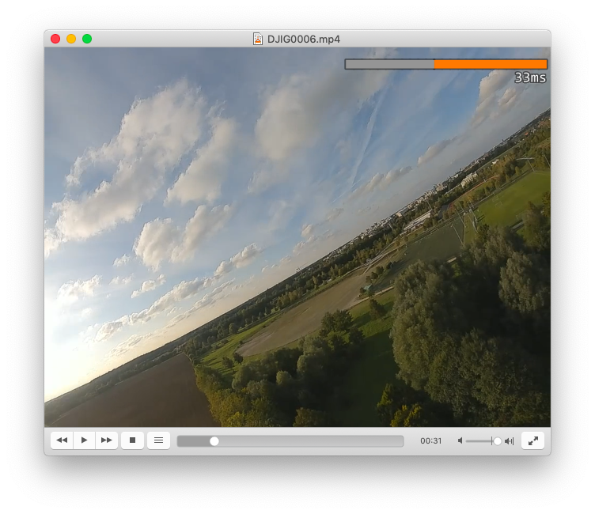

# DJI FPV SRT converter

This is a little tool to re-format or convert SRT files generated by the DJI FPV System for on-google recordings.
You run the script with a .srt file to create an .ass or .ssa file which can be viewed via VLCPlayer or used to encode into the video using handbrake or ffmpeg.

### Dependencies:

- basic perl v5x+, onboard on most Linux/OSX systems
- for Windows use cygwin (select perl package on install) or strawberr-yperl

### Features:
- reformat and filter the default Subtitle-OSD using SSA/ASS format
- optional colorized bar for bitrate
- adjustable size in percent
- adjustable colorization
- csv output without units for graphs and analysis

### Configuration:
1. open the convertsrt.pl file in your favorite editor
2. enter values for ALIGN,MARGIN,FONTSIZE,OUTPUTFORMAT
3. adjust **OUTPUTTEMPLATE** as you like
	- each field must be specified between **{**< >**}**
	- available fields are: 
		- signal
		- ch
		- flightTime
		- uavBat
		- glsBat
		- uavBatCells
		- glsBatCells
		- delay
		- bitrate
		- rcSignal
		- start_time
		- end_time 
- for ASS: 
   - use the last bit of the example 
   - \N can be used as linebreak
   - set BITRATE _BAR _ENABLE to 1 if you want to have a progress-bar 
   		- BITRATE _BAR _ENABLE 2 will create a shorter bar
	- optionally: change BITRATE _BAR _COLORS, first color will be background, follwed by the colors to gradient
   - more optionally: adjust or replace the complete **$header** for more options, easiest created with [Aegisub](http://www.aegisub.org/)
- for CSV:
	- see example or **OUTPUTTEMPLATE**
	- set BITRATE_BAR_ENABLE to 0 
   

### Usage:

*   > perl convertsrt.pl DJIG0006.srt 
*   > perl convertsrt.pl DJIG0006.srt DJIG0006.ass
*   > perl convertsrt.pl DJIG0006.srt DJIG0006.ssa
*   > perl convertsrt.pl DJIG0006.srt DJIG0006.csv
 

### Examples:

### Reference:
- [http://www.tcax.org/docs/ass-specs.htm
](https://www.youtube.com/watch?v=0y8tK6vw6Tk) 
- [https://en.wikipedia.org/wiki/SubStation_Alpha
](https://www.youtube.com/watch?v=0y8tK6vw6Tk) 
- [AndyRC: FREE DJI FPV HD Format And HardCode OSD
](https://www.youtube.com/watch?v=0y8tK6vw6Tk) 
